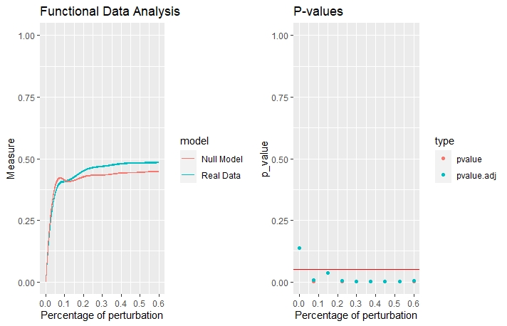
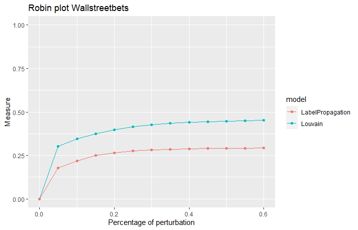

```{r setup, include=FALSE}
library(kableExtra)
library(tidyverse)
library(ggplot2)
library(plotly)
library(lubridate)
library(igraph)
library(visNetwork)
library(BatchGetSymbols)
library(scales)
library(sentimentr)
source("DB_connection.R")
set.seed(123)
```

# Overview and Motivation

In January of 2021, a major short squeeze of the stock of video game retailer GameStop and other securities took place[@RePEc]. A major driving force behind this event was the subreddit wallstreetbets, where users discussed the market situation around GameStop, focussing on the amount of short positions major hedge funds held for this stock and a “David versus Goliath”-situation unfolded. What followed was a large influx of users to the subreddit, who were convinced the stock had to go up and hedge funds had to pay for it. 
 
Several interesting questions regarding the influence of these subreddits on the stock market emerge from this event. In this project, we want to detect communities in finance related subreddits and mine their sentiment towards discussed stocks to measure if they either have significant influence on or can predict market movements.

# Related Work 

Prediction of market movements in relation to stock prices and volume of traded stocks has been widely studied mainly because it can be used as a tool for  investing in profitable stocks with small risks. The prediction of stock prices has been carried out successfully with different machine learning  techniques [@8212715].

In terms of community detection, it is possible to identify communities inside social media platforms. These communities can be roughly defined as a subset of entities that have elements in common, which could be, for example, a topic. In a broader sense, the communities are represented as subgraphs  which can be identified via  community detection methods such as graph partitioning and graph clustering. On [@papadopoulos2012community], a survey of different methods to identify communities in the context of social media.

Lastly, finding correlations between social media interaction and stock market is a complicated task. In this area, [@ruiz2012correlating] presents an exploration between twitter messages and stock-market events related to a group of specific companies. As result, it was possible to find correlations between some features from the messages and the traded volume.

# Initial Questions

Based on the objectives on our proposal, the initial questions that we tried to solve were divided in three aspects of our project, which are data extraction and storage, community detection, sentiment analysis, and correlation between sentiment and stock market information. The questions are as follows: 
 
1. How can we create communities inside subreddits and extract the stocks discussed inside each community?
2. Is it possible to correlate the sentiment towards the stocks discussed in each community to  the stock market related data?

The questions evolved during the first stages of data collecting and research about algorithms for clustering and sentiment analysis. The questions change into more specific and new questions were included. The final questions for the project are:

### 1. How can we identify subcommunities inside subreddit and which measures can be used to evaluate the subcommunities?
A subreddit is already a big community inside Reddit, which allows the interaction between users. It is important to represent the interaction from the users in order to find relations and smaller clusters from users which we can analyze afterwards.  

### 2. How can we identify stocks that are discussed in each subcommunity and the sentiment related to the stocks?
For this question we would like to find strategies that allows us to identify the stocks that are mentioned inside each community and the sentiment (positive, negative or neutral) towards the stocks.

### 3. Based on the stocks and sentiments towards them inside the communities, is it possible to find a correlation with the stock prices?
Considering the Gamestop event we would like to find out if there are relations between the sentiment that the users express in the subreddit towards a stock with the real stock prices. 

# Data


For this project we have two main sources of data, namely Reddit and Yahoo Finance. 

## Reddit comments

The data that we use from the subreddits are comments on posts and the post content.
Since the official reddit api does not allow to search for posts in a specific date range, a request via the pushshift API is made to get the URLs of the top five submissons per day which top 100 posts are subsequently downloaded using a slightly modified version of RedditExtractor's function reddit_content. 
These two functions are wrapped inside the function "ETL", to conviniently fetch the data for a given date range.

```{r}
source("retrieveModules.R")

tmp_stock <- ETL(subreddit_vec = "wallstreetbets",
                 date_list = Sys.time() - 24*60*60)
```


The structure of the retrieved comments is presented in the following table:


```{r raw_data, echo=FALSE,warning = FALSE}

databaseName <- "reddit"
collectionName <- "stocks"
initial_time <-"2021-02-10"
end_time <-"2021-02-12"

sample <- loadDataDates(databaseName,collectionName,initial_time,end_time) %>%
  subset(select = -c(ticker,sentiment))

kbl(head(sample,3)) %>%
  kable_material(c("hover")) %>%
  kable_styling(full_width = TRUE)
```
Each comment contains the information of the content of the comment, user that make the comment, the related post including the content and author. Moreover, the column "structure" define the position occupied by the comment in the hierarchy of comments related to a post.

Once a user from reddit is deleted, either the column "user" or the column "author" has the value "[deleted]". In this situation is not possible to uniquely identify users and creating the correct connection between them, which is important for the community detection. To visualize this problem, the following graphics, shows the percentage of comments per day that have deleted authors or users. In both subreddits, the highest loss of comments is originating from deleted authors with up to 50% of loss.

```{r proportionDeletedUsers, echo=FALSE,warning = FALSE}
collectionName <- "stocks"
source("reddit_related_functions.R")

#get proportion of missing comments due to deleted users
stock_comments <- get_info_deleted_users("stocks")
wallstreetbets_comments <-get_info_deleted_users("wallstreetbets")


ggplotly(ggplot(data=stock_comments, aes(x=dates)) +
           geom_line(aes(y=percentage_comments_del_users, colour="Users"))+
           geom_line(aes(y=percentage_comments_del_authors, colour="Authors"))+ 
           scale_color_manual(name = "Deleted  object",values = c(
             'Users' = 'darkred',
             'Authors' = 'steelblue'))+
           scale_x_date(date_labels = "%m-%Y")+
           labs(title="Proportion of comments with deleted author/user subreddit Stocks",
                x = "Comment Date",
                y = "Proportion of comments with deleted user/author"))

ggplotly(ggplot(data=wallstreetbets_comments, aes(x=dates)) +
           geom_line(aes(y=percentage_comments_del_users, colour="Users"))+
           geom_line(aes(y=percentage_comments_del_authors, colour="Authors"))+ 
           scale_color_manual(name = "Deleted  object",values = c(
             'Users' = 'darkred',
             'Authors' = 'steelblue'))+ 
           scale_x_date(date_labels = "%m-%Y")+
           labs(title="Proportion of comments with deleted author/user subreddit Wallstreetbets",
                x = "Comment Date",
                y = "Proportion of comments with deleted user/author"))
```

To work around this problem. We decided to delete all of the comments made by a user that was deleted and renamed the authors based on the post. 

Moreover, We stored the subreddit data in a cloud database service [MongoDB Atlas](https://www.mongodb.com/es/cloud/atlas). In this way we can reproduce our results from previous data even if the users change overtime in Reddit.

The data is stored in a single database name "reddit", which has two separate collections named "stocks" and "wallstreet" with the raw data. The manipulation of the data was made by using the library [mongolite](https://cran.r-project.org/web/packages/mongolite/mongolite.pdf).

## Stock data

To get the market data for the relevant tickers, the package ['quantmod'](https://www.quantmod.com/) is used.
It takes a list of ticker symbols, a start and an end date and returns the market
data in a clean format.

```{r stockDataExample }
tickers <- c("GME","TSLA","AMC")
l.out <- BatchGetSymbols(tickers = tickers, 
                         first.date = lubridate::ymd_hms("2021-06-07 00:00:00"),
                         last.date = lubridate::ymd_hms("2021-06-10 00:00:00"), 
                         freq.data = "daily",
                         cache.folder = file.path(tempdir(), 
                                                  'BGS_Cache'))
kbl(l.out$df.tickers)
```


Due to its caching functionality, prices have to be fetched only once, subsequent 
calls first check if the cached file contains all the relevant data.


## Feature engineering

### Sentiment analysis

To examine the correlation between market data and sentiment, this measure has to be extracted from every comment.

For calculation of the sentiment the package  [sentimentr](https://cran.r-project.org/web/packages/sentimentr/sentimentr.pdf)
It uses a dictionary based approach and also takes modifiers and negators into account, which is a major advantage in comparison to the package [SentimentAnalysis](https://cran.r-project.org/web/packages/SentimentAnalysis/SentimentAnalysis.pdf)

To consider the financial jargon used in these subreddits, the Loughran-McDonald dictionary is used for assigning polarity values to the words of a comment. The dictionary also has to be modified for the special slang of [r/wallstreetbets](www.reddit.com/r/wallstreetbets)

```{r}
# adding and preparing the slang terms of wallstreetbets with their corresponding sentiment
wsb_specific_terms <- data.frame(x=c("to the moon", "cant go tits up", "tendies", "diamond hands", "paper hands"), y=c(1,1,1,1,-1)) %>% as_key()

# creating the modified polarity dictionary
modified_dict <- lexicon::hash_sentiment_loughran_mcdonald %>% 
  update_polarity_table(x=wsb_specific_terms)

# show a sample of positive and negative words of the dictionary
print(modified_dict %>% filter(y>0) %>% sample_n(10))
print(modified_dict %>% filter(y<0) %>% sample_n(10))
```

```{r loading data}
#wsb <- loadData("reddit", "wallstreetbets")
#stocks <- loadData("reddit", "stocks")
stocks <- readRDS("stocks.Rds")
wsb <- readRDS("wsb.Rds")
```

After adding the sentiment, we take a look at the the most positive and negative comments of both subreddits.

```{r}
stocks %>% arrange(sentiment) %>% head() %>% select(comment, sentiment) %>%
  kbl() %>%
  kable_material(c("hover")) %>%
  kable_styling(full_width = TRUE)

stocks %>% arrange(desc(sentiment)) %>% head() %>% select(comment, sentiment) %>%
  kbl() %>%
  kable_material(c("hover")) %>%
  kable_styling(full_width = TRUE)

wsb %>% arrange(sentiment) %>% head() %>% select(comment, sentiment) %>%
  kbl() %>%
  kable_material(c("hover")) %>%
  kable_styling(full_width = TRUE)

wsb %>% arrange(desc(sentiment)) %>% head() %>% select(comment, sentiment) %>%
  kbl() %>%
  kable_material(c("hover")) %>%
  kable_styling(full_width = TRUE)
```

Since we are only interested in if a stock is positive, negative or neutral, the values are recoded to 1, -1 and 0 respectively.
```{r}
wsb <- wsb %>% mutate(sentiment = case_when(sentiment > 0 ~ 1,
                                            sentiment < 0 ~ -1))
stocks <- stocks %>% mutate(sentiment = case_when(sentiment > 0 ~ 1,
                                            sentiment < 0 ~ -1))
```


### Ticker Extraction

To find tickers discussed in a comment, the corresponding symbols have to be extracted.

Two approaches to achieve have been tried:

1. Regex-based extraction:

A regular expression can be used to find ticker mentions inside a comment. Ticker symbols are identified by assuming they are a two to four upper case  character long string preceeded and followed by zero or more non-alphanumeric characters, e.g. " GME." or " CDE".

```{r}
stringr::str_match_all(c("I bought AMC and BB", "I sold Palantir. PLTR was not the best stock to invest into"), '[^A-Za-z0-9]+([A-Z]{2,4})[^A-Za-z0-9]*')
```

Disadvantages of this method are:

  * False positives like "WSB" for Wallstreetbets or "ETF" for Exchange-traded fund. A remedy to this could an expansion of the regex or a subsequent filter on the most mentioned false positives.
  * Actual company names are not recognized, so if "Palantir" gets mentioned, it is not detected as PLTR.

These disadvantages can be remedied by using a dictionary-based approach.

2. Dictionary-based extraction:

For this approach a list of the top 100 actively traded stocks traded on the NYSE is used. 

```{r}
nyse_lst <- read.csv("nyse_lst.csv")
nyse_lst %>% 
  head() %>%
  kbl() %>%
  kable_material(c("hover")) %>%
  kable_styling(full_width = TRUE)
```

The names of the companies are also modified, words and Phrases like "Ltd.", "Company", "Group", "Share" have been removed manually to capture the informally used phrases one would use to refer to these companies.
In addition, tickers consisting of only one character are replaced with this modified name to avoid false matches, e.g. "F" for "Ford".

```{r}
nyse_lst_mod <- read.csv("nyse_lst_modified.csv")
nyse_lst_mod %>%
  head() %>%
  kbl() %>%
  kable_material(c("hover")) %>%
  kable_styling(full_width = TRUE)
```
To add this information, a helper function was written which adds columns for sentiment and the mentioned tickers respectively.

```{r tickerExtractionExample}
source("ticker_extraction.R")
example_df <- data.frame(comment = c("I bought AMC and BB", "I sold Palantir. PLTR was not the best stock to invest into but GME was"), user = c("A", "B"))

add_tickers_sentiment(example_df,
                      ticker_list = nyse_lst_mod)$ticker
```

Using this approach, the ticker symbols as well as the names of the companies are extracted. In addition, false positives are avoided by only extracting symbols mentioned in the modified list.

### Community detection

For the community detection we used the library igraph. For this purpose the subreddit's data was transformed into a graph representation. Nodes represent the users of the subreddit, while interaction between the users is represented by edges. The interactions are classified into:

**1. Answers to a post:** direct comments to a post. For this case an edge is created between the user and the author of the post.

**2. Answer to a comment:** comments made as answer to other comments. For this case an edge is created between two users and it requires to use the hierarchy of comments to find the proper connection.

The weight of the edges is given by the number of interactions between the two users. A visual representation of the graph created by the comments between the dates 2021-01-23 and 2021-01-26 for the subreddit is presented in the following plot.  
```{r include=FALSE}
source("cluster_evaluation.R")
```
```{r graphcreation, echo=FALSE, warning = FALSE}
posts_stocks <- stocks %>%
  filter(user!="[deleted]",comm_date>=lubridate::ymd(initial_time),
         comm_date<=lubridate::ymd(end_time))

#create igraph object
g <- create_subreddit_graph_from_df(posts_stocks)

plot(g,vertex.label=NA, vertex.color="blue", vertex.size=5)
```


**Clustering Algorithms: **

For the community detection we considered three of the available algorithms in the igraph library, they are: 

* [Louvain](https://en.wikipedia.org/wiki/Louvain_method): Algorithm based on modularity. It builds a hierarchy of communities while maximizing the modularity value. 
* [Infomap](https://www.mapequation.org/infomap/): Algorithm based on the Map equation. 
* [label propagation](https://en.wikipedia.org/wiki/Label_propagation_algorithm): The algorithm starts by given a unique labels to each node, and it propagates iteratively the labels through the network by updating the neighbors until no node need to update the label. 

Since there is no external information about the communities detected, modularity is used as main measure to evaluate the quality of the clustering. Modularity measures how strong is the community structure generated and it can be defined as "a normalized tradeoff between edges covered by clusters and squared cluster degree sums"[@modularity].

In order to compare the cluster algorithms, we evaluate all of algorithms over 4 different samples of the data as shown in the following table. We used both subreddits wallstreetbets and stocks with different sample sizes. With this test we recorded the modularity and execution time. The results from the evaluation are given in the following plots. 


```{r cluster_evaluation, warning=FALSE, message=FALSE}

evaluations <- data.frame(
  test = 1:4,
  collectionName = c("wallstreetbets", "stocks", "wallstreetbets", "stocks"),
  initial_time = c("2021-02-03", "2020-11-03", "2021-01-03", "2021-01-03"),
  end_time = c("2021-02-05", "2020-11-07", "2021-01-07", "2021-01-13"),
  number_comments = rep(NA, 4)
)

result <- data.frame()
for (i in 1:nrow(evaluations)) {
  row <- evaluations[i, ]
  if(row$collectionName =="wallstreetbets"){
    eval_df <-  wsb %>%
      filter(comm_date>=row$initial_time, comm_date<=row$end_time)
  }else{
    eval_df <-  stocks %>%
      filter(comm_date>=row$initial_time, comm_date<=row$end_time)
  }
  result_evaluation <-
    clustering_evaluation(row$test,
                          "reddit",
                          row$collectionName,
                          row$initial_time,
                          row$end_time,
                          eval_df)
  #update number of comments per test
  evaluations[[i, "number_comments"]] <-
    result_evaluation$number_comments
  result <- rbind(result, result_evaluation$df)
}

kbl(evaluations,
    col.names = c("Test",
                  "Collection Name",
                  "Initial Date", 
                  "Final Date",
                  "Sample size"),
    caption = "Test samples")

modularity_clusters <- result %>%
  filter(measure == "modularity") 

ggplotly(ggplot(data=modularity_clusters, aes(x=id_test))+
           geom_bar(aes(y=value,fill=algorithm), 
                    stat = "identity", position = "dodge")+
           labs( x = "Test",
                 y = "Modularity",
                 title = "Modularity per algorithm for each test"))

```


In terms of modularity, Louvain performed better than Infomap and Label Propagation. The highest possible value for modularity is 1.0 when all of the clusters are disconnected subgraphs. The values that Louvain achieved are higher than 0.55 which represents a strong community structure. 

When we evaluate the execution time for the different algorithms, Louvain outperfoms Infomap but the execution time is very similar between Louvain and Label propagation. 

```{r echo=FALSE, warning=FALSE}
time_algorithms <- result %>%
  filter(measure == "time")

ggplotly(ggplot(data=time_algorithms, aes(x=id_test))+
           geom_bar(aes(y=value,fill=algorithm), 
                    stat = "identity", position = "dodge")+
           labs( x = "Test",
                 y = "Execution time (s)",
                 title = "Execution time per algorithm"))
```

In addition to the previous test in separated samples, we assessed the robustness of Louvain using the library *robin* [@policastro2021robustness] for the whole data for each subreddit. 

To test the goodness of the communities detected by Louvain in the each complete subreddit we followed the first workflow from robin, where the stability of the algorithm is compared against random perturbations of the original graph. The stability measure we chose was VI metric. The results from this evaluation are in the next plots.



*Stocks subreddit*


*Wallstreetbets subreddit*

For both datasets the stability measure curves for Louvain compared to the null model are very close. For the stocks subreddit the AUC values we got were **0.2631427** for the real data and **0.2494959** for the null model and for the wallstreetbets subreddit were **0.2357264** for the real data and **0.2471575** for the null model. Considering also the p-values on the right side of the plots, we can conclude that the results from the Louvain community detection are statistically significant, which means that is a good algorithm for this dataset. For Wallstreetbets it is statistically significant just for perturbation lower than 0.3, which is not so ideal. 

When we compare with robin the best two algorithms from our modularity test (Louvain and Label Propagation) is possible to confirm the previous findings. For both subreddits Louvain outperforms the Label Propagation algorithm. 




Considering these tests, we selected *Louvain* as the clustering algorithm for the rest of the analysis in our project. For the previous graph representation of the data, the following communities were created with Louvain algorithm.

```{r cluster_example, echo = FALSE}
#create communities
lc <- cluster_louvain(g)

visualization <- create_communities_visualization_from_df(posts_stocks)
visualization
```

To analyze the content of the comments for each cluster, we inspect some random clusters to find the most common words, which are displayed in the following wordclouds. For some clusters we can find that they use quite often the same words like "stocks" and "buy", but we also observed that we have different topics on each cluster.

```{r wordcloud, warning=FALSE}
par(mfrow=c(2,2),
    oma = c(0,0,0,0),
    mar = c(0,0,0,0))
get_word_cloud_community(posts_stocks,communities(lc),2)
get_word_cloud_community(posts_stocks,communities(lc),5)
get_word_cloud_community(posts_stocks,communities(lc),8)
get_word_cloud_community(posts_stocks,communities(lc),10)
```

# Exploratory Data Analysis

### Tickers

 
```{r, echo=F}
par(mfrow=c(1,2),
    oma = c(0,0,0,0),
    mar = c(0,0,0,0))

wsb_ticker <- wsb %>%
  filter(length(ticker)!=0) %>%
  pull(ticker) %>%
  unlist() %>%
  trimws() %>%
  paste0(collapse = ",") %>%
  strsplit(",") %>%
  table() %>%
  as.data.frame() %>%
  rename(., "ticker"=".") %>%
  arrange(desc(Freq)) %>%
  head(10)

stocks_ticker <- stocks %>%
  filter(length(ticker)!=0) %>%
  pull(ticker) %>%
  unlist() %>%
  trimws() %>%
  paste0(collapse = ",") %>%
  strsplit(",") %>%
  table() %>%
  as.data.frame() %>%
  rename(., "ticker"=".") %>%
  arrange(desc(Freq)) %>%
  head(10)

plot_wsb <- ggplotly(ggplot(wsb_ticker, aes(x=reorder(ticker, (-Freq)), y=Freq)) +
           geom_col() +
           labs(x="Ticker", y="Count", title="Count of Tickers for r/wallstreetbets"))

plot_stocks <- ggplotly(ggplot(stocks_ticker, aes(x=reorder(ticker, (-Freq)), y=Freq)) +
           geom_col() +
           labs(x="Ticker", y="Count", title="Count of Tickers for r/stocks"))
plot_stocks

```

```{r, echo=F}
plot_wsb
```
While both subreddits talk mostly about the same tickers, the counts are significantly different.
More important for the analysis is the mentions of the tickers by week; there should be no longer time frames without mentions.
```{r, echo=F}
count_per_week <- function(dat, ticker_list){
  res_lst <- list()
  for (t in ticker_list){
    res_lst[[t]] <- dat %>%
      filter(t %in% ticker) %>%
      group_by("CW" = paste0(lubridate::year(comm_date), "/", ifelse(nchar(lubridate::week(comm_date))==1, paste0("0", lubridate::week(comm_date)), lubridate::week(comm_date)))) %>%
      summarise(count=n(), ticker=t)
  }
  return(dplyr::bind_rows(res_lst))
}

tickers_week_wsb <- count_per_week(wsb, wsb_ticker$ticker)
tickers_week_stocks <- count_per_week(stocks, stocks_ticker$ticker)
```
```{r}
ggplot(tickers_week_wsb, aes(x=CW, y=count)) +
  geom_col(position = "dodge") +
  theme(axis.text.x=element_text(angle = -45, hjust = 0)) +
  facet_grid(ticker~.) +
  labs(title="Count of ticker mentions by week for r/wallstreetbets")

ggplot(tickers_week_stocks, aes(x=CW, y=count)) +
  geom_col(position = "dodge") +
  theme(axis.text.x=element_text(angle = -45, hjust = 0)) +
  facet_grid(ticker~.) +
  labs(title="Count of ticker mentions by week for r/stocks")
```
It is evident here, that the mentions of tickers vary greatly. There are some weeks, where no tickers are mentioned and the counts are mostly very low. This has to be accounted for during the final analysis.


### User's interaction in subreddits

We extracted the individual users that were active in each subreddit and try to found out if there are users that are active in both subreddits. In the following plot we present the distribution of active users in the subreddits, where we found out that more than half of the users are active in wallstreetbets (52.9%) and just 7% of the active users participate both in wallstreetbets and stocks.

```{r user_interaction, echo = FALSE}
active_users <- merge(getActiveUsers("stocks"),
                  getActiveUsers("wallstreetbets"),
                  by='_id', all = TRUE) %>%
  rename(comments_stocks = comments.x, comments_wsb = comments.y, name_user = '_id') %>%
  replace_na(list(comments_stocks = 0, comments_wsb = 0)) %>%
  filter(name_user!="[deleted]") %>%
  mutate(participation = comments_stocks - comments_wsb) %>%
  mutate(subreddit = ifelse(participation>0,"stocks","wallstreetbets")) %>%
  mutate(type_participation = ifelse(comments_stocks>0 & comments_wsb>0,"Both subreddits",
                         ifelse(comments_stocks>0,"Stocks","Wallstreetbets")))


summary_users <- active_users %>%
  group_by(type_participation) %>%
  summarise(prop=(n()/nrow(active_users))*100)

ggplotly(ggplot(data=summary_users, aes(x=type_participation))+
           geom_bar(aes(y=prop),
                    stat = "identity", position = "dodge")+
           labs(title="User participation in Subreddits",
                x = "Subreddit",
                y = "Percetage"))
```

# Final Analysis

To answer the the question, if the sentiment towards a specific ticker has an influence on market data, cross-correlation between the sentiment and the percentage change of the price is used.

During the cross-correlation time series are lagged against each other, so that the  $t - lag$ values of one time series are correlated against the values of the other time series at time $t$.

Since the mentioned tickers are quite sparse, only the top 10 mentioned tickers are used and missing sentiment values are handled by `na.pass`, so they are not considered in the calculation, but simply passed through.
Imputation of the missing values is also not feasable, since sentiment values are often not available for longer time spans.

The results are visualized using the ACF plots which are returned by the `ccf` function. It shows the correlation of the two time series depending on the lag, including 95% confidence intervals.

Since applying a cross correlation function assumes that the both time series are stationary, this is ensured de-trending the timeseries before the calculation using `ndiffs` and `diff`.

The ACF Plots and summary tables for the top 10 tickers mentioned by the subreddits are shown below.

```{r, warning=FALSE}
source("analysis_helpers.R")
stocks_prep <- prepare_analysis(stocks) 
wsb_prep <- prepare_analysis(wsb)
```

```{r, echo=F}
wsb_prep %>%
  ccf_by_price_vol() %>%
  ccf_table() %>%
  kbl() %>%
  kable_material(c("hover")) %>%
  kable_styling(full_width = TRUE)
```


```{r, echo=F}
wsb_prep %>% ccf_by_price_vol(na.action = na.pass) %>% ccf_plots() %>% subplot(., nrows = length(.)/2, margin = 0.02) %>% layout(title="ACF Plots for Top 10 Tickers of r/wallstreetbets")
```
```{r, echo=F}
stocks_prep %>% ccf_by_price_vol(na.action = na.pass) %>% ccf_plots() %>% subplot(., nrows = length(.)/2, margin = 0.02) %>% layout(title="ACF Plots for Top 10 Tickers of r/stocks")
```

```{r, echo=F}
stocks_prep %>%
  ccf_by_price_vol() %>%
  ccf_table() %>%
  kbl() %>%
  kable_material(c("hover")) %>%
  kable_styling(full_width = TRUE)
```
For the stocks subreddit, we get the mean correlation for every lag is close to 0, so the sentiment could not be used to predict market movements in general.

These different outcomes probably result from the sparsity of the ticker mentions, so these conclusions should be taking with a grain of salt. Because of this, an analysis of a specific community is not feasable, the data is just too sparse. To remedy this, the extraction of the data has to be done different. Only posts which mention a specific ticker in a given time frame should be extracted to combat this problem of sparse data.

# References
